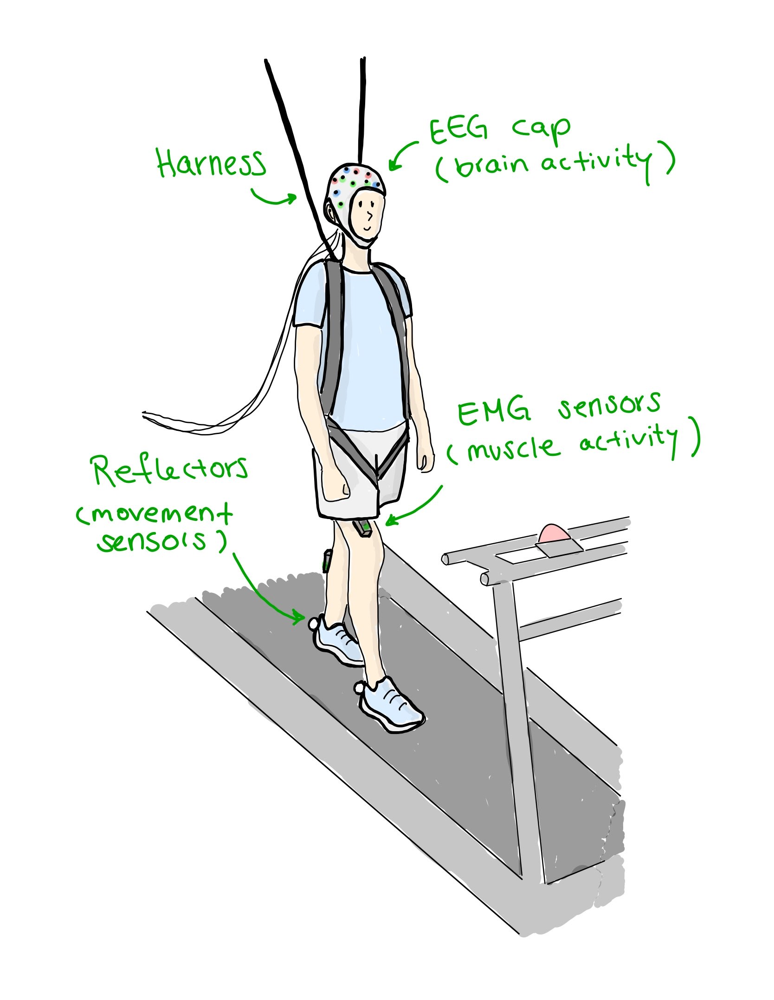

# ISPGR Workshop // Bridging the Gap - Best Practices in Mobile Brain Imaging

## Welcome
Welcome to the workshop website.

{width="50%" fig-align="center"}

## Introduction
The workshop will be held on the 28th of June in Maastricht.
please fine more detail on the [website](https://juliuswelzel.github.io/ispgr_workshop/#).

## Organizers
The meeting is organized by [Julius](mailto:j.welzel@neurologie.uni-kiel.de?subject=StepuP%20meeting) and others.
